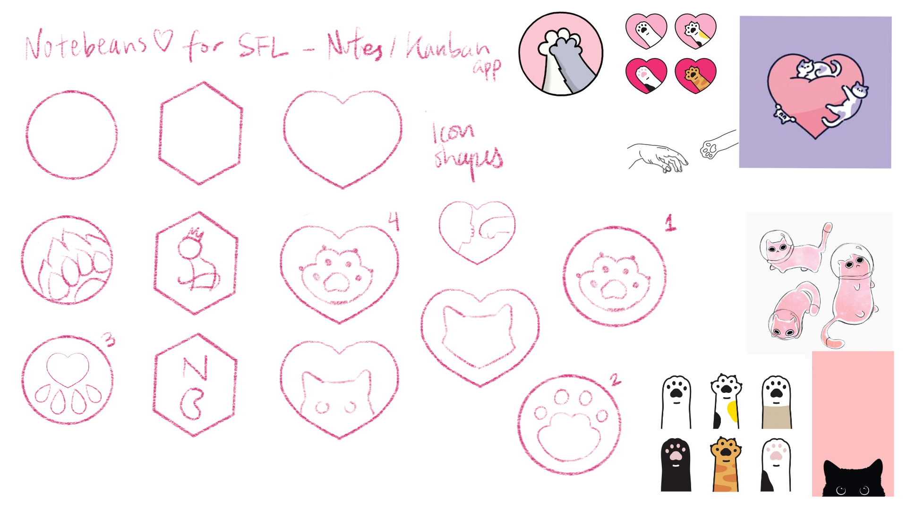
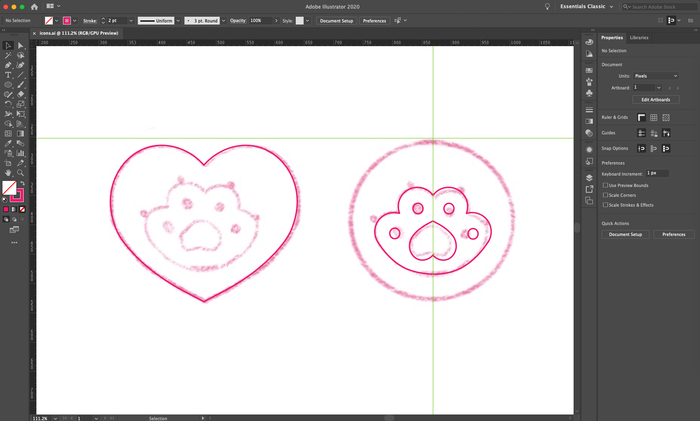
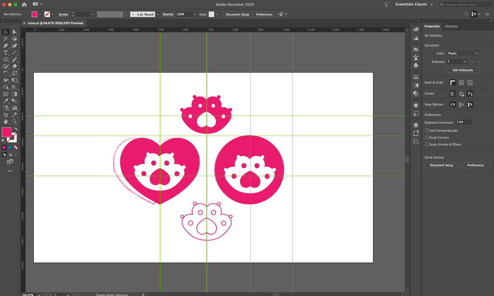
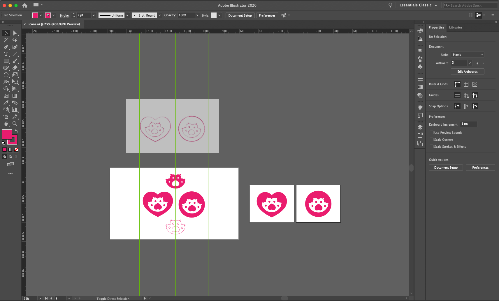

# README

## Notebeans
This is a practice project in designing and building a Docker + React app for SFL.

## Project Status
- Designing navbar logo in Adobe illustrator
- Working on adding, editing, deleting text + local storage

## Project Problems

## Project Screenshots










## Installation and Setup

```bash

yarn start

```

## Reflection

## Resources

### React Drag and Drop

- [Drag and Drop Tutorial with React DnD (Trello Clone)](https://www.youtube.com/watch?v=aK2PD_REk7A)

- [[ReactJS] Kanban Board](https://www.youtube.com/watch?v=pit07rnM9wM)

- [Kanban Board built with React and React-Beautiful-DnD](https://www.youtube.com/watch?v=HKbvwskkX1g)

- [Announcing React Kanban| Lucas Besen](https://dev.to/lucasbesen/announcing-react-kanban-480e)

  + [react-dnd](https://github.com/react-dnd/react-dnd)
  + [react-beautiful-dnd](https://github.com/atlassian/react-beautiful-dnd)

- **[react-beautiful-dnd official tutorial](https://egghead.io/lessons/react-course-introduction-beautiful-and-accessible-drag-and-drop-with-react-beautiful-dnd)**

- **[reactjs drag-drop examples](https://reactjsexample.com/tag/drag-drop/)**

- [React Dynamically Create Drag and Drop Containers
](https://www.youtube.com/watch?v=7Lt1l3YGqYg)

This tutorial added droppable rows with the click of a button. I need to add draggables in multiple columns with multiple buttons (ideally). Start first with one button in Backlog.

### Add New Notes

-[React for Beginners - Build a Todo-List App](https://www.youtube.com/watch?v=nUl5QLkVdvU)

Add/delete local storage. Also separates component into different .js files.

### Web App Design

- [how-to-make-a-web-app | budibase](https://www.budibase.com/blog/how-to-make-a-web-app/)

- [Build a beautiful, draggable kanban board with react-beautiful-dnd](https://www.youtube.com/watch?v=Vqa9NMzF3wc&t=37s)
